# Focusdam Supabase ERD

작성일: 2026-07-09

```mermaid
erDiagram
  AUTH_USERS ||--|| PROFILES : owns
  AUTH_USERS ||--|| CONSENT_SETTINGS : has
  AUTH_USERS ||--o{ CONSENT_EVENTS : records
  AUTH_USERS ||--|| NOTIFICATION_SETTINGS : has
  AUTH_USERS ||--o{ PUSH_SUBSCRIPTIONS : registers
  AUTH_USERS ||--o{ USER_SUBSCRIPTIONS : subscribes
  PLUS_PLANS ||--o{ USER_SUBSCRIPTIONS : selected_by

  AUTH_USERS ||--o{ STARTER_ACTIONS : creates
  STARTER_ACTION_TEMPLATES ||--o{ STARTER_ACTIONS : seeds
  STARTER_ACTIONS ||--o{ STARTER_SCHEDULES : scheduled_as
  STARTER_ACTIONS ||--o{ FOCUS_SESSIONS : runs
  STARTER_SCHEDULES ||--o{ FOCUS_SESSIONS : starts
  FOCUS_SESSIONS ||--o{ FOCUS_SESSION_EVENTS : logs
  FOCUS_SESSIONS ||--o{ EMOTION_RECORDS : includes

  AUTH_USERS ||--o{ PAYMENT_SAVING_GOALS : owns
  PAYMENT_SAVING_GOALS ||--o{ PAYMENT_REVIEWS : contextualizes
  PAYMENT_REVIEWS ||--o{ PAYMENT_REVIEW_FOLLOWUPS : schedules
  PAYMENT_SAVING_GOALS ||--o{ PAYMENT_SAVING_ENTRIES : accumulates
  PAYMENT_REVIEWS ||--o{ PAYMENT_SAVING_ENTRIES : produces
  PAYMENT_REVIEW_FOLLOWUPS ||--o{ PAYMENT_SAVING_ENTRIES : triggers
  PAYMENT_SAVING_GOALS ||--o{ PAYMENT_GOAL_ACHIEVEMENTS : reaches
  PAYMENT_REVIEWS ||--o{ PAYMENT_GOAL_ACHIEVEMENTS : triggers
  PAYMENT_SAVING_ENTRIES ||--o{ PAYMENT_GOAL_ACHIEVEMENTS : triggers

  AUTH_USERS ||--o{ WRITING_HELPER_HISTORIES : writes
  AUTH_USERS ||--o{ WEEKLY_REVIEWS : receives
  AUTH_USERS ||--o{ DATA_JOBS : requests

  AUTH_USERS {
    uuid id PK "사용자 ID"
    text email "이메일"
  }

  PROFILES {
    uuid user_id PK,FK "사용자 ID"
    text email "이메일"
    text display_name "표시명"
    social_provider social_provider "소셜 로그인"
    text timezone "시간대"
    text locale "언어"
    timestamptz onboarded_at "온보딩 완료일"
    timestamptz created_at "생성일"
    timestamptz updated_at "수정일"
  }

  CONSENT_SETTINGS {
    uuid user_id PK,FK "사용자 ID"
    boolean analysis_usage "분석 동의"
    boolean emotion_record "감정 기록 동의"
    boolean spending_record "소비 기록 동의"
    timestamptz created_at "생성일"
    timestamptz updated_at "수정일"
  }

  CONSENT_EVENTS {
    uuid id PK "동의 이력 ID"
    uuid user_id FK "사용자 ID"
    consent_key consent_key "동의 항목"
    boolean granted "동의 여부"
    text policy_version "약관 버전"
    consent_source source "변경 경로"
    jsonb metadata "부가 정보"
    timestamptz created_at "생성일"
  }

  NOTIFICATION_SETTINGS {
    uuid user_id PK,FK "사용자 ID"
    boolean start_reminder "시작 알림"
    boolean spend_hold "소비 보류 알림"
    boolean emotion_reset "감정 리셋 알림"
    boolean quiet_hours "방해금지"
    time quiet_hours_start "방해금지 시작"
    time quiet_hours_end "방해금지 종료"
    text timezone "시간대"
    timestamptz created_at "생성일"
    timestamptz updated_at "수정일"
  }

  PUSH_SUBSCRIPTIONS {
    uuid id PK "푸시 구독 ID"
    uuid user_id FK "사용자 ID"
    text endpoint "푸시 주소"
    text p256dh "공개 키"
    text auth "인증 키"
    text user_agent "기기 정보"
    boolean is_active "활성 여부"
    timestamptz created_at "생성일"
    timestamptz last_seen_at "마지막 확인일"
  }

  PLUS_PLANS {
    uuid id PK "플랜 ID"
    text code "플랜 코드"
    text name "플랜명"
    text billing_interval "결제 주기"
    integer amount_krw "원화 금액"
    text provider_price_id "결제사 가격 ID"
    boolean is_active "판매 여부"
  }

  USER_SUBSCRIPTIONS {
    uuid id PK "구독 ID"
    uuid user_id FK "사용자 ID"
    uuid plan_id FK "플랜 ID"
    text provider "결제사"
    text provider_customer_id "고객 ID"
    text provider_subscription_id "구독 ID"
    subscription_status status "구독 상태"
    timestamptz current_period_start "이용 시작일"
    timestamptz current_period_end "이용 종료일"
    timestamptz canceled_at "해지일"
    boolean cancel_at_period_end "종료 해지"
    text payment_method_summary "결제수단 요약"
  }

  STARTER_ACTION_TEMPLATES {
    uuid id PK "템플릿 ID"
    text category "카테고리"
    text label "라벨"
    text title "제목"
    text description "설명"
    text difficulty "난이도"
    integer default_duration_minutes "기본 시간"
    integer recommended_duration_minutes "추천 시간"
    boolean is_active "노출 여부"
  }

  STARTER_ACTIONS {
    uuid id PK "행동 ID"
    uuid user_id FK "사용자 ID"
    uuid template_id FK "템플릿 ID"
    starter_action_source source "생성 출처"
    text title "제목"
    text subtitle "부제"
    text target "대상"
    text micro_action "최소 행동"
    text verb "동사"
    text category "카테고리"
    integer planned_duration_minutes "계획 시간"
    integer recommended_duration_minutes "추천 시간"
    boolean is_favorite "즐겨찾기"
    timestamptz last_started_at "마지막 시작일"
    timestamptz archived_at "보관일"
  }

  STARTER_SCHEDULES {
    uuid id PK "예약 ID"
    uuid user_id FK "사용자 ID"
    uuid starter_action_id FK "행동 ID"
    timestamptz scheduled_at "예약 시각"
    starter_schedule_status status "예약 상태"
    timestamptz created_at "생성일"
    timestamptz updated_at "수정일"
  }

  FOCUS_SESSIONS {
    uuid id PK "세션 ID"
    uuid user_id FK "사용자 ID"
    uuid starter_action_id FK "행동 ID"
    uuid schedule_id FK "예약 ID"
    text title_snapshot "실행 제목"
    text subtitle_snapshot "실행 부제"
    integer planned_duration_minutes "계획 시간"
    integer recommended_duration_minutes "추천 시간"
    timestamptz started_at "시작일"
    timestamptz ended_at "종료일"
    integer actual_duration_seconds "실제 시간"
    integer overrun_seconds "초과 시간"
    focus_session_status status "세션 상태"
    completion_mood completion_mood "완료감"
    focus_level focus_level "집중도"
  }

  FOCUS_SESSION_EVENTS {
    uuid id PK "이벤트 ID"
    uuid user_id FK "사용자 ID"
    uuid session_id FK "세션 ID"
    focus_event_type event_type "이벤트 종류"
    text event_reason "이벤트 사유"
    jsonb metadata "부가 정보"
    timestamptz occurred_at "발생일"
  }

  EMOTION_RECORDS {
    uuid id PK "감정 기록 ID"
    uuid user_id FK "사용자 ID"
    uuid session_id FK "세션 ID"
    text emotion_label "감정 이름"
    smallint intensity "강도"
    text trigger_note "원인 메모"
    text reset_action "리셋 행동"
    boolean returned_to_focus "복귀 여부"
    timestamptz created_at "생성일"
  }

  PAYMENT_SAVING_GOALS {
    uuid id PK "목표 ID"
    uuid user_id FK "사용자 ID"
    text name "목표명"
    integer target_amount_krw "목표 금액"
    integer current_saved_amount_krw "현재 저축액"
    saving_goal_status status "목표 상태"
    date due_date "목표일"
  }

  PAYMENT_REVIEWS {
    uuid id PK "결제 3심 ID"
    uuid user_id FK "사용자 ID"
    uuid goal_id FK "목표 ID"
    text item_name "상품명"
    integer amount_krw "금액"
    payment_impulse_strength impulse_strength "충동 강도"
    payment_need_timing need_timing "필요 시점"
    payment_alternative_status alternative_status "대체재 여부"
    payment_review_decision initial_decision "최초 결정"
    payment_outcome_type outcome_type "결과 유형"
    payment_review_status status "진행 상태"
    text reason "판단 이유"
    text reward "보상"
    boolean satisfaction_reminder "만족도 알림"
    text budget_category "예산 분류"
    text buy_reason "결제 이유"
    payment_saving_target saving_target "저축 대상"
  }

  PAYMENT_REVIEW_FOLLOWUPS {
    uuid id PK "후속 처리 ID"
    uuid user_id FK "사용자 ID"
    uuid review_id FK "결제 3심 ID"
    payment_followup_type followup_type "후속 유형"
    integer sequence "회차"
    payment_followup_status status "처리 상태"
    timestamptz scheduled_at "예정일"
    timestamptz completed_at "완료일"
    payment_reminder_decision reminder_decision "리마인드 결정"
    smallint satisfaction_score "만족도 점수"
    text memo "메모"
    text summary "요약"
  }

  PAYMENT_SAVING_ENTRIES {
    uuid id PK "저축 원장 ID"
    uuid user_id FK "사용자 ID"
    uuid goal_id FK "목표 ID"
    uuid review_id FK "결제 3심 ID"
    uuid followup_id FK "후속 처리 ID"
    integer amount_krw "저축액"
    payment_saving_source source "발생 출처"
    text note "메모"
    timestamptz created_at "생성일"
  }

  PAYMENT_GOAL_ACHIEVEMENTS {
    uuid id PK "목표 달성 ID"
    uuid user_id FK "사용자 ID"
    uuid goal_id FK "목표 ID"
    uuid trigger_review_id FK "유발 기록"
    uuid trigger_saving_entry_id FK "유발 원장"
    integer achieved_amount_krw "달성 금액"
    integer target_amount_krw "목표 금액"
    integer saved_review_count "저축 기록 수"
    timestamptz achieved_at "달성일"
  }

  WRITING_HELPER_HISTORIES {
    uuid id PK "작성 기록 ID"
    uuid user_id FK "사용자 ID"
    writing_message_type message_type "글 유형"
    writing_tone tone "말투"
    text recipient "상대"
    text reason "이유"
    text topic "주제"
    text requested_action "요청 행동"
    text closing_request "마무리 요청"
    jsonb result_snapshot "결과 스냅샷"
    text edited_draft "수정 문장"
    integer copied_count "복사 횟수"
    timestamptz last_copied_at "마지막 복사일"
  }

  WEEKLY_REVIEWS {
    uuid id PK "주간 리뷰 ID"
    uuid user_id FK "사용자 ID"
    date week_start_date "주 시작일"
    date week_end_date "주 종료일"
    weekly_review_status status "생성 상태"
    integer saved_amount_krw "절약액"
    integer started_count "착수 횟수"
    numeric return_rate "복귀율"
    jsonb summary_snapshot "요약 스냅샷"
    jsonb insights_snapshot "인사이트 스냅샷"
    jsonb recommendation_snapshot "추천 스냅샷"
    timestamptz generated_at "생성일"
  }

  DATA_JOBS {
    uuid id PK "작업 ID"
    uuid user_id FK "사용자 ID"
    data_job_type job_type "작업 유형"
    data_export_format export_format "내보내기 형식"
    date start_date "시작일"
    date end_date "종료일"
    data_job_status status "처리 상태"
    text result_storage_path "결과 파일 경로"
    timestamptz requested_at "요청일"
    timestamptz processed_at "처리일"
    timestamptz expires_at "만료일"
    text error_message "오류 메시지"
    jsonb metadata "부가 정보"
  }
```

## 필드 메모

### Auth/Profile

| table | field memo |
| --- | --- |
| `AUTH_USERS` | `id` 사용자 ID, `email` 이메일 |
| `PROFILES` | `user_id` 사용자 ID, `email` 이메일, `display_name` 표시명, `social_provider` 소셜 로그인, `timezone` 시간대, `locale` 언어, `onboarded_at` 온보딩 완료일, `created_at` 생성일, `updated_at` 수정일 |

### Consent/Notification

| table | field memo |
| --- | --- |
| `CONSENT_SETTINGS` | `user_id` 사용자 ID, `analysis_usage` 분석 활용 동의, `emotion_record` 감정 기록 동의, `spending_record` 소비 기록 동의, `created_at` 생성일, `updated_at` 수정일 |
| `CONSENT_EVENTS` | `id` 동의 이력 ID, `user_id` 사용자 ID, `consent_key` 동의 항목, `granted` 동의 여부, `policy_version` 약관 버전, `source` 변경 경로, `metadata` 부가 정보, `created_at` 생성일 |
| `NOTIFICATION_SETTINGS` | `user_id` 사용자 ID, `start_reminder` 시작 알림, `spend_hold` 소비 보류 알림, `emotion_reset` 감정 리셋 알림, `quiet_hours` 방해금지 사용, `quiet_hours_start` 시작 시각, `quiet_hours_end` 종료 시각, `timezone` 시간대, `created_at` 생성일, `updated_at` 수정일 |
| `PUSH_SUBSCRIPTIONS` | `id` 푸시 구독 ID, `user_id` 사용자 ID, `endpoint` 푸시 주소, `p256dh` 공개 키, `auth` 인증 키, `user_agent` 기기 정보, `is_active` 활성 여부, `created_at` 생성일, `last_seen_at` 마지막 확인일 |

### Subscription

| table | field memo |
| --- | --- |
| `PLUS_PLANS` | `id` 플랜 ID, `code` 플랜 코드, `name` 플랜명, `billing_interval` 결제 주기, `amount_krw` 원화 금액, `provider_price_id` 결제사 가격 ID, `is_active` 판매 여부 |
| `USER_SUBSCRIPTIONS` | `id` 구독 ID, `user_id` 사용자 ID, `plan_id` 플랜 ID, `provider` 결제사, `provider_customer_id` 결제사 고객 ID, `provider_subscription_id` 결제사 구독 ID, `status` 구독 상태, `current_period_start` 이용 시작일, `current_period_end` 이용 종료일, `canceled_at` 해지일, `cancel_at_period_end` 기간 종료 해지, `payment_method_summary` 결제수단 요약 |

### Starter/Focus

| table | field memo |
| --- | --- |
| `STARTER_ACTION_TEMPLATES` | `id` 템플릿 ID, `category` 카테고리, `label` 라벨, `title` 제목, `description` 설명, `difficulty` 난이도, `default_duration_minutes` 기본 시간, `recommended_duration_minutes` 추천 시간, `is_active` 노출 여부 |
| `STARTER_ACTIONS` | `id` 행동 ID, `user_id` 사용자 ID, `template_id` 템플릿 ID, `source` 생성 출처, `title` 제목, `subtitle` 부제, `target` 대상, `micro_action` 최소 행동, `verb` 동사, `category` 카테고리, `planned_duration_minutes` 계획 시간, `recommended_duration_minutes` 추천 시간, `is_favorite` 즐겨찾기, `last_started_at` 마지막 시작일, `archived_at` 보관일 |
| `STARTER_SCHEDULES` | `id` 예약 ID, `user_id` 사용자 ID, `starter_action_id` 행동 ID, `scheduled_at` 예약 시각, `status` 예약 상태, `created_at` 생성일, `updated_at` 수정일 |
| `FOCUS_SESSIONS` | `id` 세션 ID, `user_id` 사용자 ID, `starter_action_id` 행동 ID, `schedule_id` 예약 ID, `title_snapshot` 실행 제목, `subtitle_snapshot` 실행 부제, `planned_duration_minutes` 계획 시간, `recommended_duration_minutes` 추천 시간, `started_at` 시작일, `ended_at` 종료일, `actual_duration_seconds` 실제 시간, `overrun_seconds` 초과 시간, `status` 세션 상태, `completion_mood` 완료감, `focus_level` 집중도 |
| `FOCUS_SESSION_EVENTS` | `id` 이벤트 ID, `user_id` 사용자 ID, `session_id` 세션 ID, `event_type` 이벤트 종류, `event_reason` 이벤트 사유, `metadata` 부가 정보, `occurred_at` 발생일 |
| `EMOTION_RECORDS` | `id` 감정 기록 ID, `user_id` 사용자 ID, `session_id` 세션 ID, `emotion_label` 감정 이름, `intensity` 강도, `trigger_note` 원인 메모, `reset_action` 리셋 행동, `returned_to_focus` 복귀 여부, `created_at` 생성일 |

### Payment Third Review

| table | field memo |
| --- | --- |
| `PAYMENT_SAVING_GOALS` | `id` 목표 ID, `user_id` 사용자 ID, `name` 목표명, `target_amount_krw` 목표 금액, `current_saved_amount_krw` 현재 저축액, `status` 목표 상태, `due_date` 목표일 |
| `PAYMENT_REVIEWS` | `id` 결제 3심 ID, `user_id` 사용자 ID, `goal_id` 목표 ID, `item_name` 상품명, `amount_krw` 금액, `impulse_strength` 충동 강도, `need_timing` 필요 시점, `alternative_status` 대체재 여부, `initial_decision` 최초 결정, `outcome_type` 결과 유형, `status` 진행 상태, `reason` 판단 이유, `reward` 보상, `satisfaction_reminder` 만족도 알림, `budget_category` 예산 분류, `buy_reason` 결제 이유, `saving_target` 저축 대상 |
| `PAYMENT_REVIEW_FOLLOWUPS` | `id` 후속 처리 ID, `user_id` 사용자 ID, `review_id` 결제 3심 ID, `followup_type` 후속 유형, `sequence` 회차, `status` 처리 상태, `scheduled_at` 예정일, `completed_at` 완료일, `reminder_decision` 리마인드 결정, `satisfaction_score` 만족도 점수, `memo` 메모, `summary` 요약 |
| `PAYMENT_SAVING_ENTRIES` | `id` 저축 원장 ID, `user_id` 사용자 ID, `goal_id` 목표 ID, `review_id` 결제 3심 ID, `followup_id` 후속 처리 ID, `amount_krw` 저축액, `source` 발생 출처, `note` 메모, `created_at` 생성일 |
| `PAYMENT_GOAL_ACHIEVEMENTS` | `id` 목표 달성 ID, `user_id` 사용자 ID, `goal_id` 목표 ID, `trigger_review_id` 달성 유발 기록, `trigger_saving_entry_id` 달성 유발 원장, `achieved_amount_krw` 달성 금액, `target_amount_krw` 목표 금액, `saved_review_count` 저축 기록 수, `achieved_at` 달성일 |

### Writing/Review/Data

| table | field memo |
| --- | --- |
| `WRITING_HELPER_HISTORIES` | `id` 작성 기록 ID, `user_id` 사용자 ID, `message_type` 글 유형, `tone` 말투, `recipient` 상대, `reason` 이유, `topic` 주제, `requested_action` 요청 행동, `closing_request` 마무리 요청, `result_snapshot` 결과 스냅샷, `edited_draft` 수정 문장, `copied_count` 복사 횟수, `last_copied_at` 마지막 복사일 |
| `WEEKLY_REVIEWS` | `id` 주간 리뷰 ID, `user_id` 사용자 ID, `week_start_date` 주 시작일, `week_end_date` 주 종료일, `status` 생성 상태, `saved_amount_krw` 절약액, `started_count` 착수 횟수, `return_rate` 복귀율, `summary_snapshot` 요약 스냅샷, `insights_snapshot` 인사이트 스냅샷, `recommendation_snapshot` 추천 스냅샷, `generated_at` 생성일 |
| `DATA_JOBS` | `id` 작업 ID, `user_id` 사용자 ID, `job_type` 작업 유형, `export_format` 내보내기 형식, `start_date` 시작일, `end_date` 종료일, `status` 처리 상태, `result_storage_path` 결과 파일 경로, `requested_at` 요청일, `processed_at` 처리일, `expires_at` 만료일, `error_message` 오류 메시지, `metadata` 부가 정보 |

## 도메인별 관계 요약

- `profiles`, `consent_settings`, `notification_settings`는 사용자당 1개다.
- `starter_actions`는 행동 원본이고, `focus_sessions`는 실행 기록이다.
- `focus_session_events`와 `emotion_records`는 주간 리뷰의 원천 이벤트다.
- `payment_reviews`는 결제 판단 본문이고, `payment_review_followups`는 24시간/3일 뒤 판단 이벤트다.
- `payment_saving_entries`는 절약 금액의 원장이다. 목표의 현재 금액은 원장에서 재계산 가능하다.
- `weekly_reviews`는 원천 이벤트의 캐시이며, 앱 화면에 보여준 리포트 스냅샷을 보존한다.
